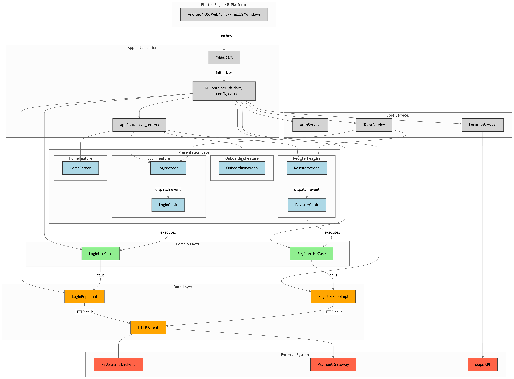
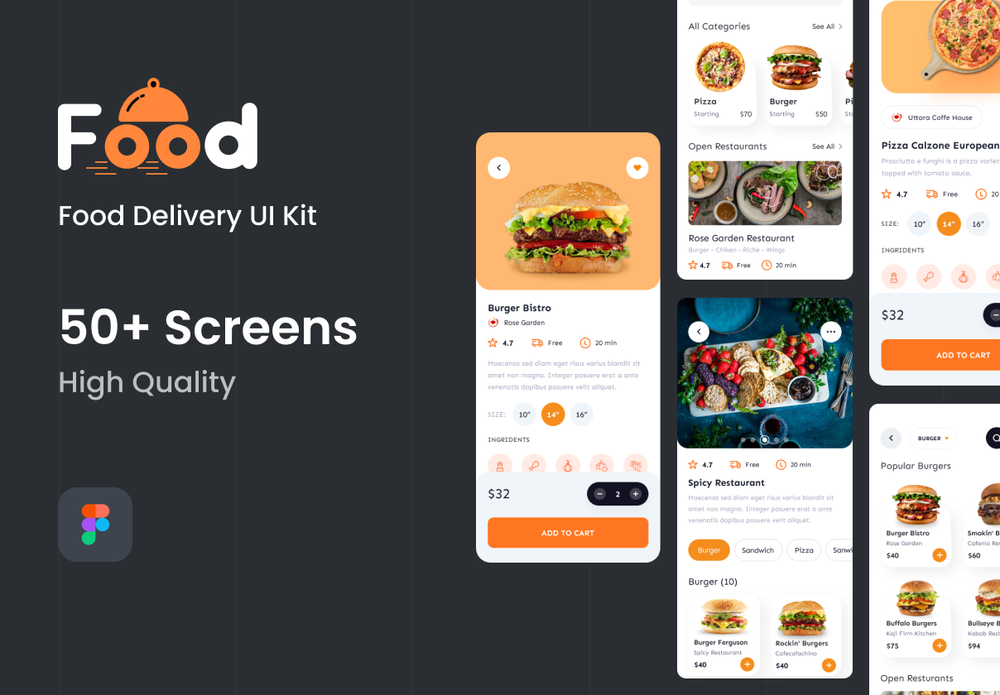
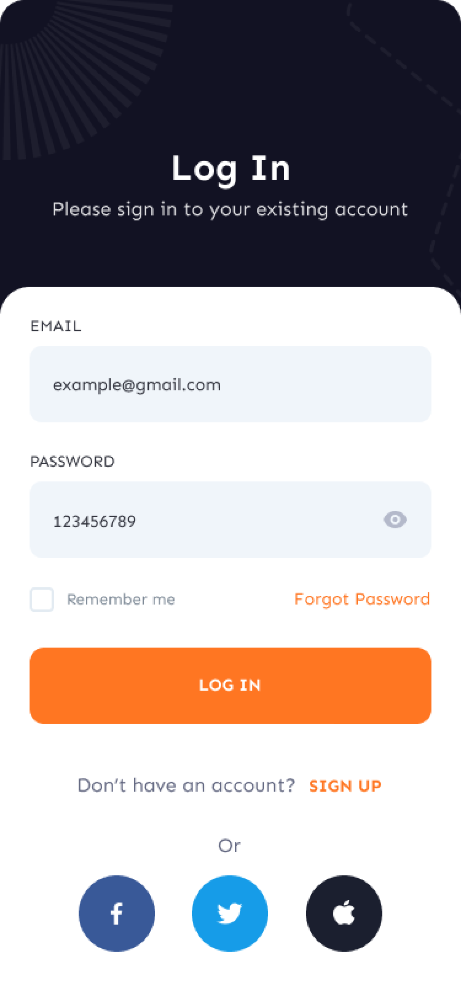
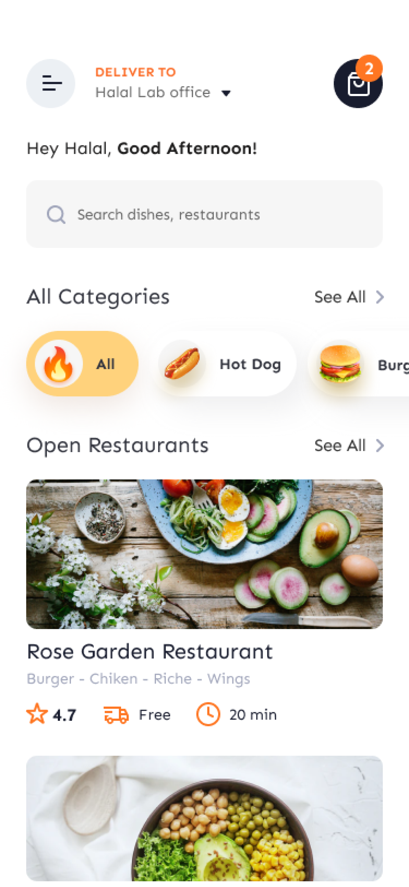
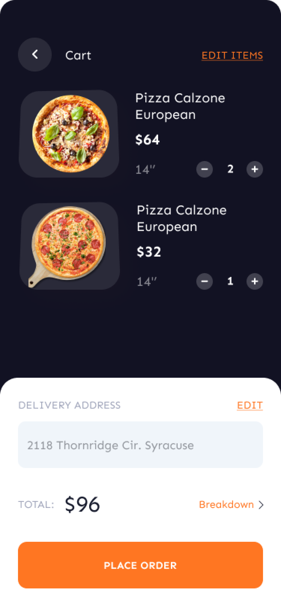
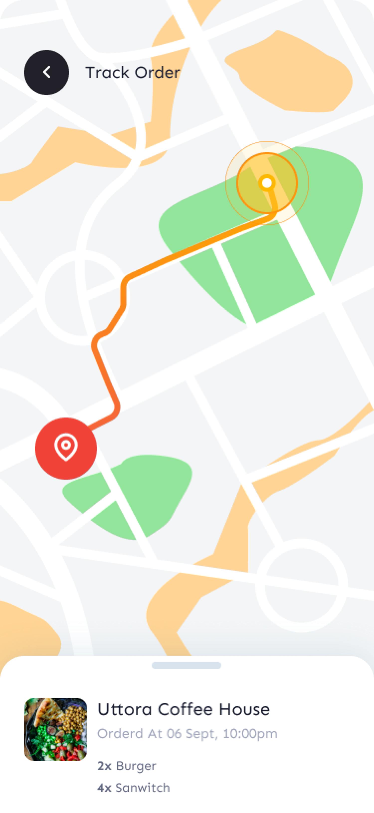
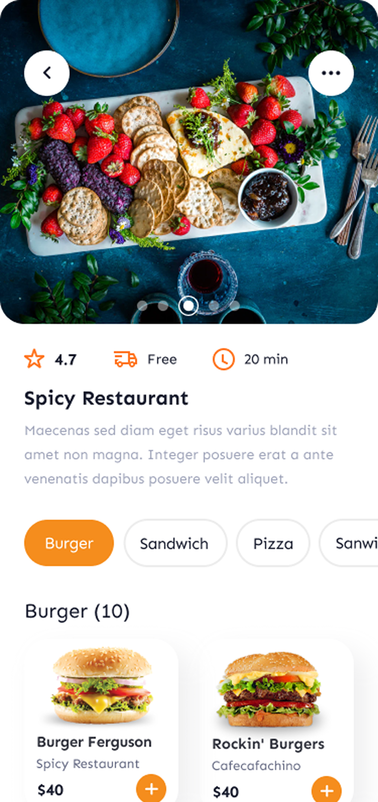
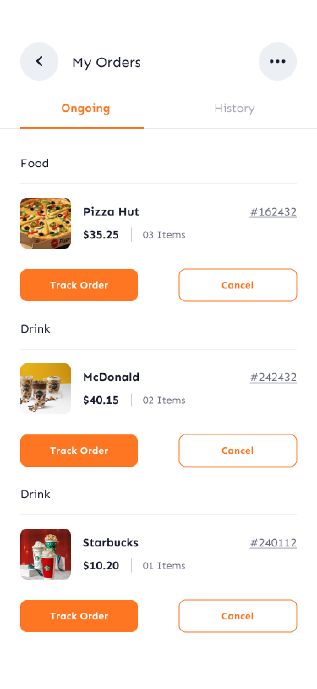
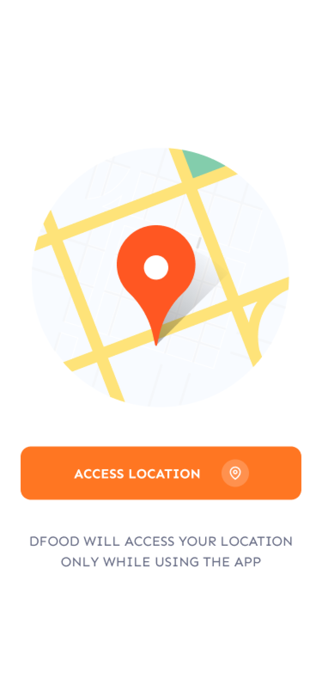
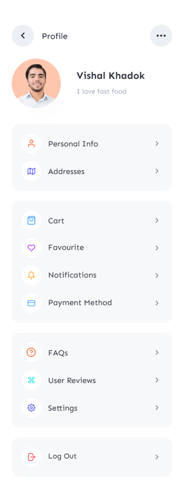

## ✨ Badges


  
  

---

## 🍔 Food Delivery App

A modern Food Delivery App built with Flutter. The app provides an intuitive UI and seamless experience for browsing restaurants, selecting meals, and placing orders.
---

> ⚠️ **Project Status: In Development**  
>
> This project is still under active development.  
> Features, structure, and dependencies may change frequently until a stable release is published.  
> Contributions and feedback are always welcome!

---

## 📑 Table of Contents
- [✨ Badges](#-badges)
- [🍔 Food Delivery App](#-food-delivery-app)
- [🚀 Features](#-features)
- [📊 App Architecture](#-app-architecture)
- [🚀 Getting Started](#-getting-started)
- [📦 Dependencies Used](#-dependencies-used)
- [🎨 Figma Design](#-figma-design)
- [📸 Screenshots](#-screenshots)
- [🎥 Demo](#-demo)
- [🛠️ Contributions](#️-contributions)
- [📜 License](#-license)

---

## 🚀 Features

- 📱 **Beautiful UI** with responsive design  
- 🍕 **Browse Restaurants & Menus** with images and categories  
- 🛒 **Cart Management** – add, remove, and update items  
- 💳 **Checkout & Payment Flow** (dummy integration for demo)  
- 🔔 **Order Tracking** with live updates  
- 👤 **User Authentication** (Sign up & login)  
- 🌙 **Dark/Light Theme Support**

---

## 📊 App Architecture



```plaintext
lib
├───core
│   ├───constants
│   ├───di
│   ├───gen
│   ├───models
│   ├───routes
│   │   └───args
│   ├───services
│   └───utils
├───features
│   ├───access_location
│   │   └───ui
│   │       └───screens
│   ├───call
│   │   ├───data
│   │   ├───domain
│   │   └───ui
│   │       ├───cubit
│   │       └───screens
│   ├───cart
│   │   └───ui
│   │       ├───cubits
│   │       └───screens
│   ├───food_details
│   │   ├───data
│   │   │   └───models
│   │   └───ui
│   │       └───screens
│   ├───forget_password
│   │   └───ui
│   │       └───screens
│   ├───home
│   │   ├───data
│   │   │   ├───models
│   │   │   └───repo
│   │   ├───domain
│   │   │   ├───entities
│   │   │   ├───repo
│   │   │   └───usecases
│   │   └───ui
│   │       ├───cubit
│   │       ├───screens
│   │       └───widgets
│   ├───login
│   │   ├───data
│   │   │   └───repo
│   │   ├───domain
│   │   │   ├───repo
│   │   │   └───usecases
│   │   └───ui
│   │       ├───cubit
│   │       └───screens
│   ├───message
│   │   ├───data
│   │   ├───domain
│   │   └───ui
│   │       ├───cubit
│   │       └───screens
│   ├───my_orders
│   │   ├───data
│   │   ├───domain
│   │   └───ui
│   │       ├───cubit
│   │       └───screens
│   ├───onboarding
│   │   ├───data
│   │   │   └───models
│   │   └───ui
│   │       └───screens
│   ├───payment
│   │   ├───data
│   │   │   └───models
│   │   ├───enums
│   │   └───ui
│   │       ├───cubits
│   │       ├───screens
│   │       └───widgets
│   ├───profile
│   │   ├───data
│   │   ├───domain
│   │   └───ui
│   │       ├───cubit
│   │       └───screens
│   ├───register
│   │   ├───data
│   │   │   └───repo
│   │   ├───domain
│   │   │   ├───repo
│   │   │   └───usecases
│   │   └───ui
│   │       ├───cubit
│   │       └───screens
│   ├───restaurant_details
│   │   ├───data
│   │   │   ├───models
│   │   │   └───repo
│   │   ├───domain
│   │   │   ├───entities
│   │   │   ├───repo
│   │   │   └───usecases
│   │   └───ui
│   │       ├───cubit
│   │       └───screens
│   ├───search
│   │   ├───data
│   │   │   ├───models
│   │   │   └───repo
│   │   ├───domain
│   │   │   ├───entities
│   │   │   ├───repo
│   │   │   └───usecases
│   │   └───ui
│   │       ├───cubit
│   │       ├───screens
│   │       └───widgets
│   ├───tracking_order
│   │   ├───data
│   │   ├───domain
│   │   └───ui
│   │       ├───cubit
│   │       └───screens
│   └───verification_password
│       └───ui
│           └───screens
└───shared
    ├───cubits
    ├───data
    │   ├───models
    │   └───repos
    ├───domain
    │   ├───entities
    │   ├───repos
    │   └───usecases
    └───widgets
```
---

## 🚀 Getting Started

To run this app locally:

```bash
git clone https://github.com/AmrSalahDev/FoodDelivery.git
cd FoodDelivery
flutter pub get
flutter run
```

---

## 📦 Dependencies Used  

Below is a list of packages used in this Flutter project along with their versions:  

## 🚀 Core
- `flutter` – Flutter SDK  
- `cupertino_icons: ^1.0.8` – iOS-style icons  
- `meta: ^1.16.0` – Provides annotations for better code clarity  

## 📦 State Management & DI
- `flutter_bloc: ^9.1.1` – Bloc/Cubit pattern for managing app state  
- `equatable: ^2.0.7` – Simplify equality comparisons  
- `get_it: ^8.2.0` – Simple service locator for dependency injection  
- `injectable: ^2.5.1` – Code generator for GetIt DI setup  
- `injectable_generator: ^2.8.1` – Generates boilerplate for Injectable  

## 🎨 UI & Animations
- `after_layout: ^1.2.0` – Execute code after the first layout  
- `animated_custom_dropdown: ^3.1.1` – Animated customizable dropdown  
- `animated_digit: ^3.3.1+2` – Animated number counter  
- `awesome_card: ^1.1.7` – Credit/Debit card UI widget  
- `bounce: ^1.0.2` – Bounce effect animations  
- `carousel_slider: ^5.1.1` – Image/content slider  
- `custom_refresh_indicator: ^4.0.1` – Custom pull-to-refresh indicator  
- `flutter_credit_card: ^4.1.0` – Credit card input & visualization  
- `flutter_screenutil: ^5.9.3` – Responsive UI scaling across devices  
- `flutter_staggered_animations: ^1.1.1` – Staggered list/grid animations  
- `flutter_svg: ^2.2.0` – Render SVG images  
- `font_awesome_flutter: ^10.10.0` – Font Awesome icon pack  
- `google_fonts: ^6.3.0` – Use Google Fonts easily in Flutter  
- `group_button: ^5.3.4` – Grouped button widget  
- `lottie: ^3.3.1` – Play Lottie animations  
- `readmore: ^3.0.0` – Expandable/collapsible text widget  
- `scroll_to_hide: ^2.2.1` – Hide widgets on scroll  
- `shimmer: ^3.0.0` – Shimmer loading effect  
- `skeletonizer: ^2.1.0+1` – Skeleton loaders for shimmer effect  
- `smooth_page_indicator: ^1.2.1` – PageView indicators with animations  
- `toastification: ^3.0.3` – Beautiful toast notifications  

## 🔄 Routing & Navigation
- `go_router: ^16.2.0` – Declarative navigation & routing  
- `go_transitions: ^0.8.2` – Smooth navigation transitions  

## 📱 Native Features
- `location: ^8.0.1` – Access device location services  
- `geocoding: ^4.0.0` – Convert coordinates ↔ addresses  
- `flutter_native_splash: ^2.4.6` – Configure a native splash screen  

## ☁️ Backend & Data
- `supabase_flutter: ^2.10.0` – Supabase client for Flutter  
- `flutter_dotenv: ^6.0.0` – Load environment variables from `.env`  
- `cached_network_image: ^3.4.1` – Caching & loading network images  
- `faker: ^2.2.0` – Generate fake data for testing  
- `uuid: ^4.5.1` – Generate unique IDs  

## 🔐 Auth & Verification
- `pinput: ^5.0.1` – PIN input widget  
- `otp_resend_timer: ^1.0.0` – OTP countdown timer  

## 🛠️ Development & Build Tools
- `build_runner: ^2.7.0` – Runs code generation  
- `flutter_gen_runner: ^5.11.0` – Asset & font generator  
- `rename: ^3.1.0` – Easily rename app package & bundle ID  
- `change_app_package_name: ^1.5.0` – Change Android package name  
- `sentry_flutter: ^9.6.0` – Error monitoring & crash reporting  
- `clarity_flutter: ^1.4.0` – Microsoft Clarity analytics integration  
- `extension: ^0.6.0` – Handy Dart/Flutter extensions  

## 🧰 Custom Toolkit
- `my_flutter_toolkit` – Custom utility package  
  - Source: [MyFlutterToolKit](https://github.com/AmrSalahDev/MyFlutterToolKit)


---


### 🎨 Figma Design

Here’s the app UI design created in Figma:

[](https://www.figma.com/community/file/1231521889522325040/food-delivery-app)

📌 Click the image to view the live Figma prototype.


---

### 📸 Screenshots

<p float="left">
  
  
  
  
  
  
  
  
  
  
</p>


---

### 🛠️ Contributions

Feel free to fork the repo, open issues, or submit PRs to improve the app!
